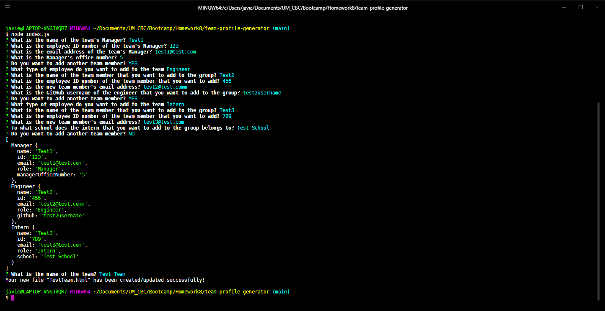
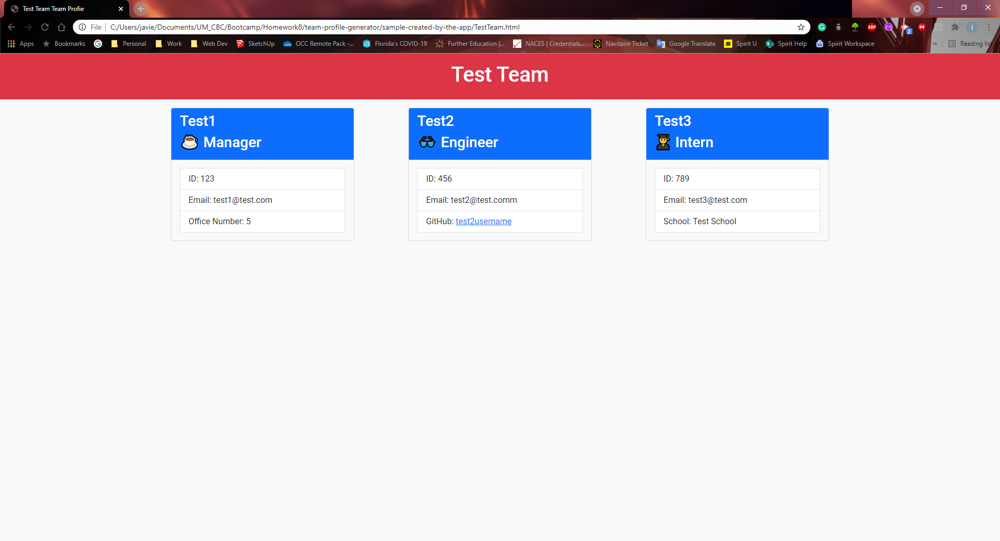

# team-profile-generator

##Summary:

This app builds a new team profile HTML file that can be rendered in the browser. The app takes the input provided by the user to build the cards that will be added to the page with the information provided for each team member. The user can add one manager and as many engineers and interns as required. The HTML file uses bootstrap classes. No additional styles sheet is required to render it properly.

## Images:

1. Console Interface:

2. HTML file rendered in the browser:  

## Videos:

1. Application Functionality: https://drive.google.com/file/d/1bf63hWBI1B0NSusbW8SB78o9EmMpwuv3/view

2. Automated Tests: https://drive.google.com/file/d/19Ovbir86cRqh_4xFe2M8i2RiOL8Gefvl/view
